# GLM-5.3-Flash on 4× CMP 170HX — Deployment Lab Notes

English | [中文](README.md)

> Measured deployment data, layout comparison and recommended configurations for GLM-5.3-Flash on a 4×CMP 170HX (mining-card) rig. All numbers are measured on this machine; raw JSON receipts live in `data/`, charts are generated by `scripts/make_charts.py`, per-day experiment records in `notebooks/`.
>
> Style and credit model follow the community experiment notebooks of [PixelML/club-170hx](https://github.com/PixelML/club-170hx); the engine and recipe come from [Morrowmake/glm53-flash-cmp170hx-recipe](https://github.com/Morrowmake/glm53-flash-cmp170hx-recipe).

## Hardware and baseline

| Item | Configuration |
|---|---|
| GPU | 4× CMP 170HX 64GB (GA100, sm_80), power limit unlocked to 250 W (stock 180 W) |
| PCIe | All four slots negotiate **Gen2 x4** (confirmed across cold power cycles; no P2P, `nvidia-smi topo -p2p` reports GNS everywhere) |
| Weights | canada-quant/GLM-5.3-Flash-W4A16-MTP (W4A16 Marlin, 320B MoE) |
| Drafter | incoai/GLM-5.3-Flash-DFlash2 (CC BY-NC-ND 4.0, evaluation only) |
| Engine | Morrowmake vLLM fork, recipe v1.4.1 (commit 378c37b00) → **v1.6.0** (commit 3a2bf16da, wheel b6761e8ded) |
| Protocol | MiaAI-Lab `bench_decode.py` regime: T=0, thinking off (output still contains reasoning text), 400-token outputs, median of 3 warmed runs |

## Main results

### Engine 1.4.1 → 1.6.0 (PP4, short-input c1, median of 3)

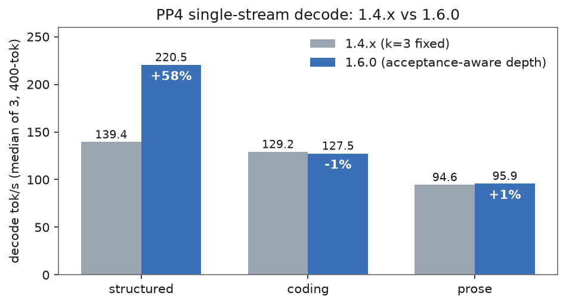

| Prompt | 1.4.1 | 1.6.0 | Δ |
|---|---|---|---|
| structured | 139.4 | **220.5** | +58% |
| coding | 129.2 | 127.5 | flat |
| prose | 94.6 | 95.9 | flat |

The structured gain matches 1.6.0's acceptance-aware speculative depth. Acceptance rate by draft position under a mixed workload (630 steps):

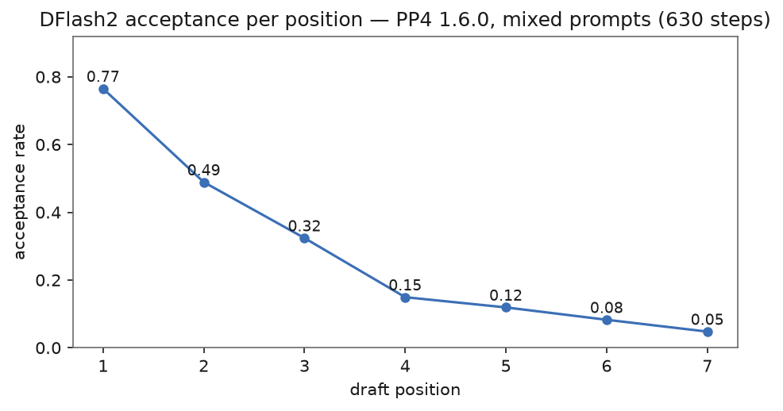

Structured text consumes the full adaptive depth; coding and prose decay after the shallow positions — consistent with only structured improving above.

### TP4 vs PP4 on 1.6.0 (x4 links)

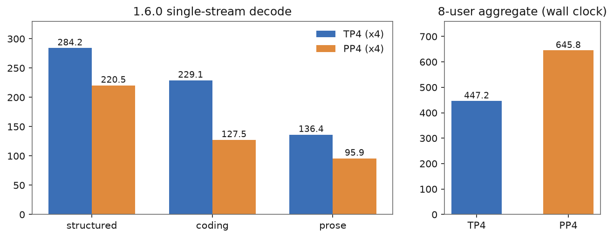

| Prompt | TP4 | PP4 | Note |
|---|---|---|---|
| c1 structured | **284.2** | 220.5 | interactive single-stream → TP4 |
| c1 coding | **229.1** | 127.5 | |
| c1 prose | **136.4** | 95.9 | |
| 8-user structured aggregate (wall clock) | 447.2 | **645.8** | batch throughput → PP4 |

### Quantified gap to a Gen2 x16 rig (1.6.0, both TP4, host-shm all-reduce, P2P off)

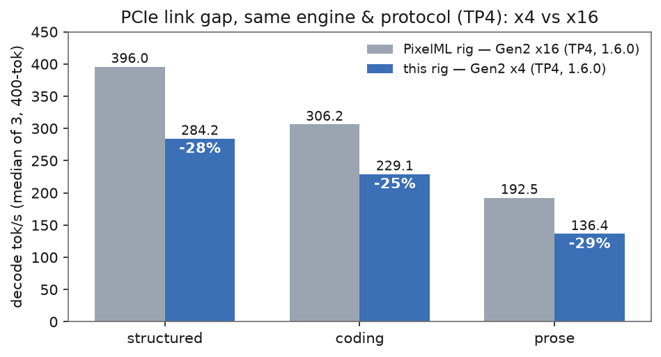

| Prompt | this rig (x4) | PixelML 1.6.0 (x16) | gap |
|---|---|---|---|
| c1 structured | 284.2 | 396.0 | −28% |
| c1 coding | 229.1 | 306.2 | −25% |
| c1 prose | 136.4 | 192.5 | −29% |
| 8-user aggregate | 447.2 | 798.6 | −44% |

Single-stream loses 25–29%; the aggregate gap widens to 44% as all-reduce payloads grow with batch size. The two rigs' KV pools differ by 0.9% (1,081,579 vs 1,072,150), ruling out software differences.

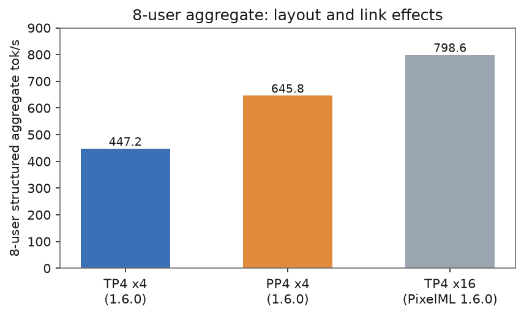

### Long input (PP4 1.6.0, ~482K tokens, two runs)

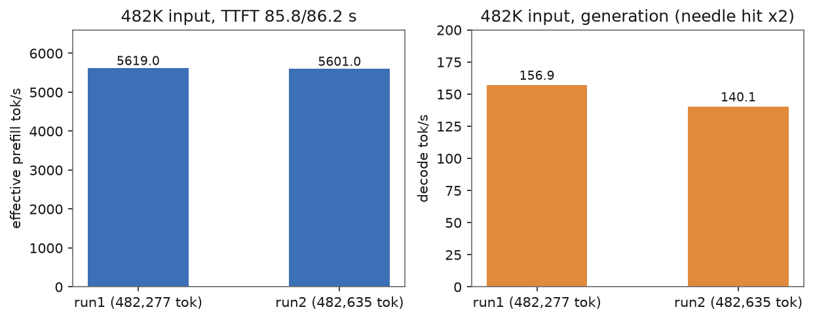

| Run | TTFT | effective prefill | generation | needle |
|---|---|---|---|---|
| 1 (482,277 tok) | 85.8 s | 5,619 tok/s | 156.9 tok/s | hit |
| 2 (482,635 tok) | 86.2 s | 5,601 tok/s | 140.1 tok/s | hit |

### Three layouts on 1.4.x (historical, pre-upgrade)

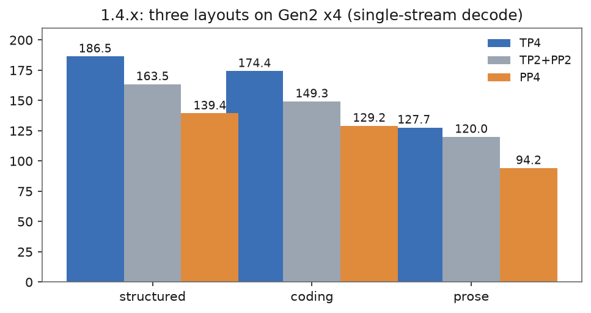

Single-stream decode ranks TP4 > TP2+PP2 > PP4; TP2+PP2 is optimal on neither axis.

### Negative results (save others the detour)

- **Clock locking does nothing**: `nvidia-smi -lgc 1695` applies, but under load the clocks still read 1470–1485 MHz (max 1695); decode 283.7 vs 284.2 unlocked. Frequency is bounded by the vBIOS voltage curve and ignores software locks.
- **SPEC_N=5 is not worth it**: accept 64.1%→48.3%, +1% throughput, −31% KV pool (1.4.x data; 1.6.0's adaptive depth makes manual k-tuning moot).
- **P2P is a pessimization on PLX topologies** (PixelML data); this x4 rig cannot negotiate P2P anyway — the host-shm all-reduce path is the right one.

## Recommended configuration

Pick by workload; engine 1.6.0, DFlash2 speculative decoding (adaptive depth), `expandable_segments:False`, prefix caching on (sanitized configs in `configs/`):

| Workload | Layout | MAX_LEN | Expected level |
|---|---|---|---|
| Interactive single-stream / low latency | `LAYOUT=tp4` | 262144 | c1 structured ~284 tok/s |
| Batch throughput / long context / multi-tenant | `LAYOUT=pp4` | 524288 | 482K prefill ~5,600 tok/s, long-input generation ~140–157 tok/s, 8-user aggregate ~646 tok/s |

Key points:

1. **Always launch through the recipe launcher** (`LAYOUT=tp4|pp4 ./start.sh`), never hand-assemble PP/TP — the launcher carries layer split, PP runtime settings, block size and allocator configuration.
2. **Since 1.6.0, PP4 supports DFlash2 only** as the speculative mode; `SPEC_MODE=none/mtp` are untested and unsupported.
3. Two local mitigations needed on 1.4.x (forced GC after module load, workspace-growth allowance) are **both no longer needed** on 1.6.0's pure default configuration (A/B verified).
4. PP4 keeps its prefill and aggregate-throughput advantage on narrow links (x4, even x1); TP4 needs all-x16 to reach published community numbers — on x4 its aggregate degrades badly.
5. Known edges: concurrent cold prefill interleaves and starves decode (PP scheduling; recovers with cache hits); an 8-stream long-input batch occasionally misses a simple needle check (1 of 8; single-stream unaffected).
6. Upgrade trap: `do_install`'s editable install of the fork uninstalls `flashinfer`, and the verify step then fails in a loop on slow links. Manually install `flashinfer-python`, write the stamp (`commit` line + `reqs <first 16 hex of sha256>`), and the skip path takes over.

## Comparison with 2× DGX Spark (TensorFold EXL3) — 2026-10-02

A third system: 2× DGX Spark (GB10, 128GB unified memory each), TensorFold runtime, `GLM-5.3-Flash-EXL3` 4bpw weights, OpenAI-compatible API. **The baseline protocol is identical to the tables above** (same prompts, T=0, 400-token outputs, median of 3); the long-text task is the same Red Alert storyline creative request.

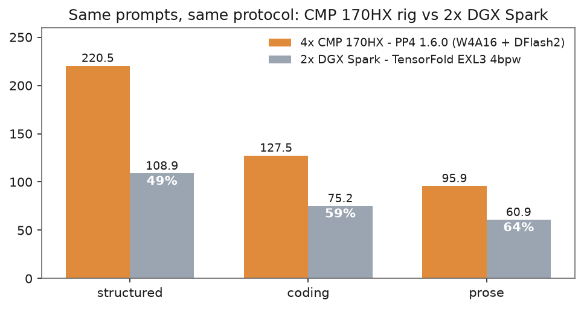

| Prompt | 4× CMP 170HX (PP4 1.6.0) | 2× DGX Spark (EXL3) | DGX/CMP |
|---|---:|---:|---:|
| c1 structured | 220.5 | 108.9 | 49% |
| c1 coding | 127.5 | 75.2 | 59% |
| c1 prose | 95.9 | 60.9 | 64% |

End-to-end long text (creative task, same prompt, two instruction variants):

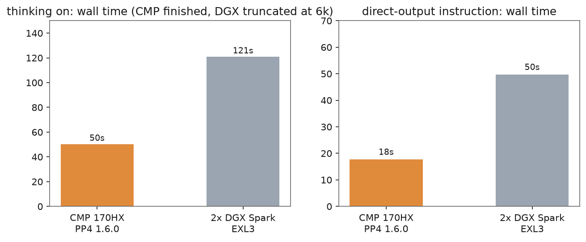

| Task | CMP 170HX | 2× DGX Spark | Note |
|---|---|---|---|
| thinking on, 6,000-token budget | 50.4 s, completed normally (654 Chinese chars of body) | 121.0 s and **truncated** (all 6,000 tokens spent on reasoning, 0 body) | CMP 49.6 tok/s vs DGX 49.6 tok/s — similar rates, but the DGX side burns tokens on reasoning faster |
| direct-output instruction, 2,500-token budget | 17.7 s (769 Chinese chars) | 49.7 s, truncated again (only 208 Chinese chars of body) | CMP 84.7 tok/s vs DGX 50.3 tok/s |

Observed differences and attribution (the two systems differ in more than one way; main variables below):

1. **Short-input generation: CMP leads 1.6–2.0×.** CMP runs W4A16 Marlin weights + DFlash2 speculative decoding (adaptive depth; ~4.5 tokens/step on structured text). The DGX side's EXL3 4bpw uses per-layer dequantized row decoding, and TensorFold has no equivalent speculative win on GB10 — roughly 1 token/step. Speculative amplification on predictable text is the dominant factor.
2. **End-to-end long text: the gap widens to 2.9× (18 s vs 50 s).** On top of the base rate difference (84.7 vs 50.3 tok/s), the DGX side reasons more verbosely (the same direct-output instruction still produces ~7,900 chars of English analysis first), compounding truncation risk.
3. **Context capacity: different roles.** The DGX pair's 256GB unified memory targets longer contexts and larger batches; the CMP configuration caps at 512K but leads across the board in measured single-stream generation and prefill rates.
4. Role note: DGX is TensorFold's target hardware (Apple Silicon / modern NVIDIA unified runtime); CMP 170HX is Morrowmake's target (sm_80 mining cards). This is each open-source stack measured on its own best-fit hardware, not a same-hardware runtime comparison.

## Community landscape gap table (2026-10-04, structured prompt)

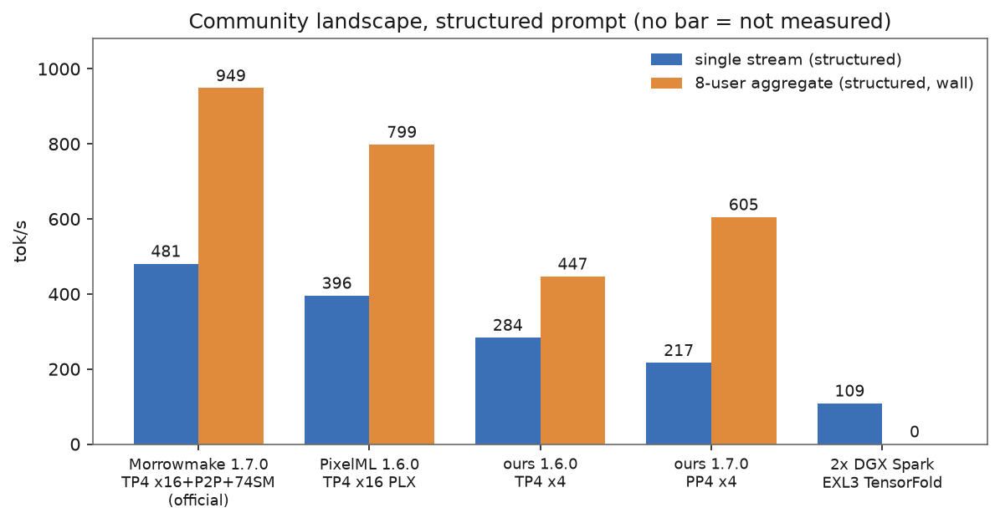

| System | Version / layout / link | c1 structured | 8-user aggregate | 482K prefill |
|---|---|---:|---:|---:|
| Morrowmake reference rig | 1.7.0 · TP4 · x16 · P2P on · 74 SM | **481** | **949** | ~3,197 |
| PixelML rig | 1.6.0 · TP4 · x16 (PLX) · no P2P | 396.0 | 798.6 | — |
| **this rig** | 1.6.0 · TP4 · x4 | 284.2 | 447.2 | 1,017 (old 500K run) |
| **this rig (production)** | 1.7.0 · PP4 · x4 | 216.9 | 605.2 | **5,616** |
| 2× DGX Spark | EXL3 4bpw · TensorFold | 108.9 | — | — |

coding/prose rank identically across systems (CMP 156.4–229.1 vs DGX 75.2; 95.9–136.4 vs 60.9), not repeated per row.

### Where the gap comes from: attribution (c1 structured 216.9 vs official 481 = 45%)

| Variable | Magnitude (measured) | Software-fixable? |
|---|---|---|
| Link x4 vs x16 | **−28%** same-version TP4 (284.2 vs 396.0) | no (board firmware) |
| Layout PP4 vs TP4 | same rig same version **−22%** single-stream (220.5 vs 284.2); aggregate flips (+35%) | yes (pick layout per workload) |
| 74 SM unlock | official +5.7% compute (70→74 SM) | needs cmpunlocker driver patch (phase 2) |
| P2P on | official 1.7.0 default; was a pessimization on PixelML's PLX; cannot negotiate on x4 | retest after cmpunlocker |
| 1.7.0 kernels | this rig coding +22.6%; structured/long-input flat | obtained |

Multiplying 0.72 (link) × 0.78 (layout) ≈ 0.56, plus the official 1.7.0 P2P+74SM gains, matches our 45% total gap — **no unexplained loss**. Remaining convergence: 74 SM unlock and P2P (hardware/driver layer, phase 2); the x4 link itself is not software-solvable.

### Phase 2: cmpunlocker 74-SM unlock and P2P measurement (2026-10-04, on 1.7.0)

Installed Morrowmake's cmpunlocker fork (`--p2p --profile=8gb --no-iommu --no-passthrough`, gcc-12, driver 610.43.03 with `ForceP2P=0x11`): **SM 70→74 on all four cards**, and the P2P content check passes **108/108** — GPU peer access works on this x4 mining rig for the first time. With P2P on, the 8-user aggregate regresses **−13.6%** (522.9 vs 645.3; bandwidth-starved P2P serialization loses to host-shm, matching PixelML's PLX observation), so production uses `P2P=off`:

| Metric | 1.6.0 (70 SM) | 1.7.0 (74 SM, P2P off) | Δ |
|---|---:|---:|---|
| c1 structured | 220.5 | 219.8 | flat |
| c1 coding | 127.5 | **167.3** | **+31%** |
| c1 prose | 95.9 | **101.5** | +5.8% |
| 8-user aggregate | 645.8 | 645.3 | flat |
| 482K prefill | 5,596–5,619 | **5,656–5,778** | +2.6% |

Rollback: old modules and conf backed up in `/root/cmpunlocker_backup_20261004/` on the rig; restore + reboot returns to 70 SM; `remove.sh` uninstalls. Also: 1.7.0's BOOT_CHECK kills a healthy launch with a URLError while the engine is still warming up (reported upstream; bypassed with `BOOT_CHECK=0` and verified by hand).

## Conclusions (2026-10-04, phase 2 complete)

1. **Final production configuration**: Morrowmake 1.7.0 (engine c1ce6491) · PP4 · MAX_LEN=524288 · cmpunlocker 74 SM · `P2P=off` · `BOOT_CHECK=0` · DFlash2 adaptive depth. Current level: c1 structured 219.8 / coding **167.3** / prose 101.5 tok/s, 8-user aggregate 645.3, 482K prefill 5,656–5,778, generation ~147 tok/s. **vs pre-upgrade (1.4.1): coding +31%, prose +5.8%, prefill +2.6%, KV pool 1.39M→2.72M, zero regressions.**
2. **Gains by version**: 1.6.0 came from acceptance-aware depth (structured +58%); 1.7.0 from the new kernels (coding +31%, a speculation-friendly loop on code); the 74-SM unlock contributed prefill +2.6% and part of coding/prose.
3. **Layout by workload**: interactive single-stream → TP4 (structured 284); batch / long-context / multi-tenant → PP4 (aggregate 645, 482K prefill 5,656, KV 2.72M). TP2+PP2 wins on neither axis — dropped.
4. **P2P, two conclusions**: the 108/108 content check proves driver patches can open peer access on an x4 mining rig (overturning "GNS has no fix"); but at Gen2-x4 bandwidth P2P costs **−13.6%** on the aggregate, so production must run `P2P=off`. P2P gains are bandwidth-dependent: +10% on x16 (official), negative on narrow links.
5. **The link is all that remains**: vs the official reference rig (x16+P2P+74 SM) our 45% single-stream gap = link −28% × layout −22%, plus their P2P/74-SM gains — no unexplained loss; the software stack is fully caught up. If x16 is restored (board firmware): TP4 structured projects ~437–481, PP4 aggregate ~900+.
6. **Negative-results list**: clock locking is a no-op (vBIOS voltage curve); thinking on/off does not change generation speed (rate = drafter predictability); manual SPEC_N tuning is obsolete; P2P on narrow links is a pessimization; block-level cache misses on sub-4608-token prompts are normal.
7. **Rollback and backup**: old driver modules/config in `/root/cmpunlocker_backup_20261004/` on the rig; restore + reboot returns to 70 SM; `remove.sh` uninstalls. Every version's bench JSON and configs are in `data/` and `configs/`.

### Layout × P2P matrix (2026-10-04, 1.7.0 @ 74 SM, Gen2 x4, 262144)

All four cells measured (each its own launch + content check / P2P=off, same protocol, median of 3):

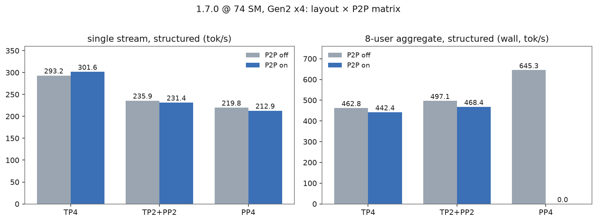

| Layout × P2P | c1 structured | c1 coding | c1 prose | 8-user aggregate |
|---|---:|---:|---:|---:|
| TP4 · P2P off | 293.2 | 223.1 | 143.4 | **462.8** |
| TP4 · P2P on | **301.6** | **227.5** | **152.5** | 442.4 (−4.4%) |
| TP2+PP2 · P2P off | 235.9 | 188.2 | 125.2 | **497.1** |
| TP2+PP2 · P2P on | 231.4 | 188.4 | 123.2 | 468.4 (−5.8%) |
| PP4 · P2P off (production) | 219.8 | 167.3 | 101.5 | **645.3** |
| PP4 · P2P on | 212.9 | 163.2 | 98.9 | 522.9 (−19.1%) |

Matrix findings:

1. **P2P direction follows layout communication volume**: TP4 (all-reduce) gains +3–6% single-stream but loses −4.4% aggregate; TP2+PP2 is roughly neutral; PP4 (stage hops) turns negative even single-stream, −19.1% aggregate. At Gen2-x4 bandwidth **no row shows a strict win**.
2. **1.7.0 changed the 1.4.x layout ranking**: TP2+PP2 is back — single-stream 235.9 beats PP4's 219.8, coding 188.2 beats PP4's 167.3, and its 497.1 aggregate beats TP4's 462.8. The old "wins nowhere" conclusion no longer holds; the new kernels favor the middle layout.
3. **The best cell in every layout is P2P off**; TP4 single-stream can squeeze +2.9% structured from P2P at a −4.4% aggregate cost.

## Repository layout

```
├── README.md            Chinese report
├── README_EN.md         this file
├── notebooks/           per-day experiment records (pins, tables, reproduction)
├── data/                sanitized raw JSON receipts
├── configs/             sanitized launch configs (PP4 / TP4)
├── scripts/             chart generator (matplotlib, single-source numbers)
├── assets/charts/       chart PNGs
└── LICENSE
```


### Would P2P scale up on x16? (assessment)

**x16 itself is the big lever (+40% single-stream); P2P adds ~10% on top.**

- Official 1.7.0 (x16 root ports, verified P2P on, 74 SM) measures 481 tok/s single-stream: +22% over their 1.6.0 no-P2P 394, of which P2P + the new all-reduce contribute ~10%; the rest is 74 SM plus the new kernels
- Counter-evidence: PixelML's PLX topology saw P2P 2stage as a pessimization; our x4 measured c8 −13.6% with P2P — P2P gains are bandwidth-dependent, and serialization overhead eats them on narrow links
- Priority: **restore the x16 link (board firmware/BIOS) >> P2P** (after x16, `P2P=auto` verifies and enables itself); on this x4 rig `P2P=off` is the data-backed optimum

Quantified expectation if x16 is restored (official numbers folded onto our rig): TP4 c1 structured 284 → ~437-481; PP4 8-user aggregate 645 → ~900+ (official 949); 482K prefill 5,616 → 6,300+.

## Reproduction

```bash
git clone https://github.com/Morrowmake/glm53-flash-cmp170hx-recipe && cd glm53-flash-cmp170hx-recipe
git checkout v1.6.0
printf 'LAYOUT=pp4\nMODELS_DIR=/path/to/models\n' > .env
./install.sh && ./download.sh && ./start.sh
```

Protocol: MiaAI-Lab `tests/bench_decode.py`, T=0, `enable_thinking=false`, 400 tokens, median of 5 (3 here). Note the model still writes a reasoning preamble into `content` with thinking off (documented upstream); token counts come from `usage`. Charts: `pip install matplotlib && python scripts/make_charts.py`.

## Licence and credits

Recipe MIT; vLLM fork Apache-2.0; DFlash2 weights CC BY-NC-ND 4.0 (evaluation use; contact for commercial). Thanks to Morrowmake for the CMP 170HX recipe and sm_80 kernels, PixelML Club CMP 170HX for independent experiments and diagnostics, MiaAI-Lab for the measurement protocol, canada-quant for the W4A16 weights, incoai for the drafter, and Z.ai for open-sourcing GLM-5.3-Flash. This repository is a local reproduction and measurement record of their work.
