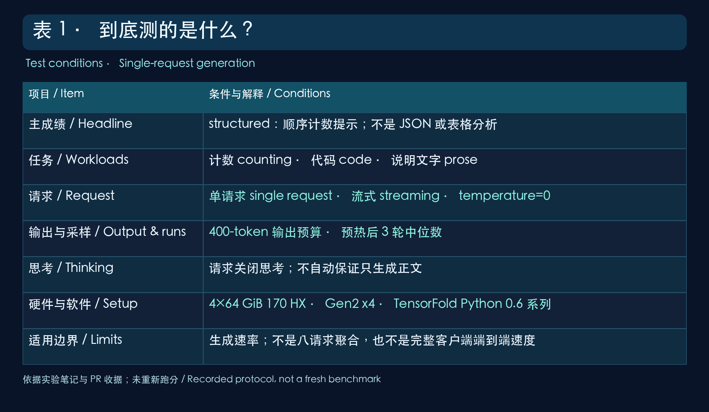
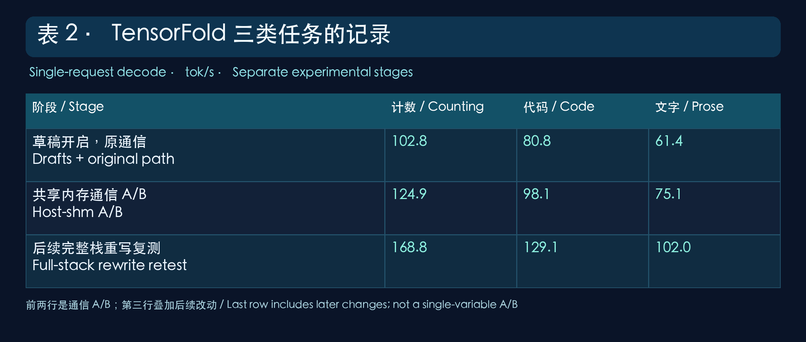
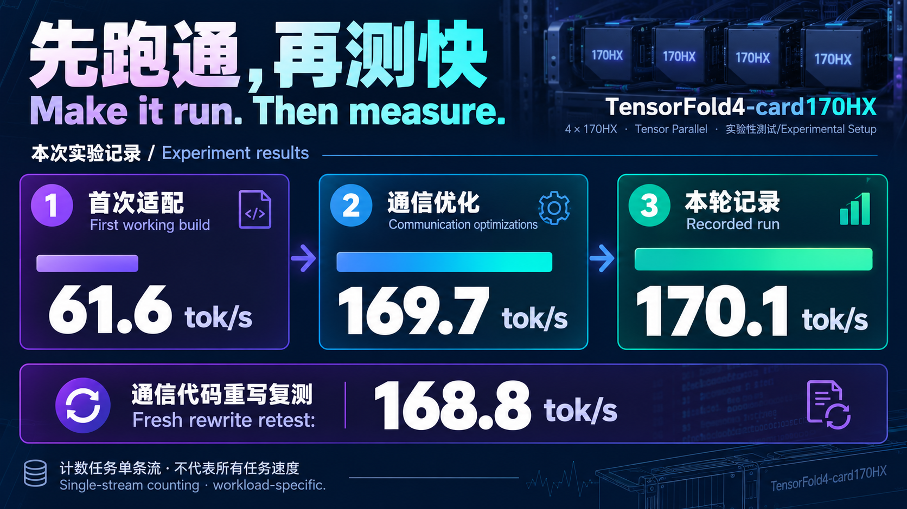
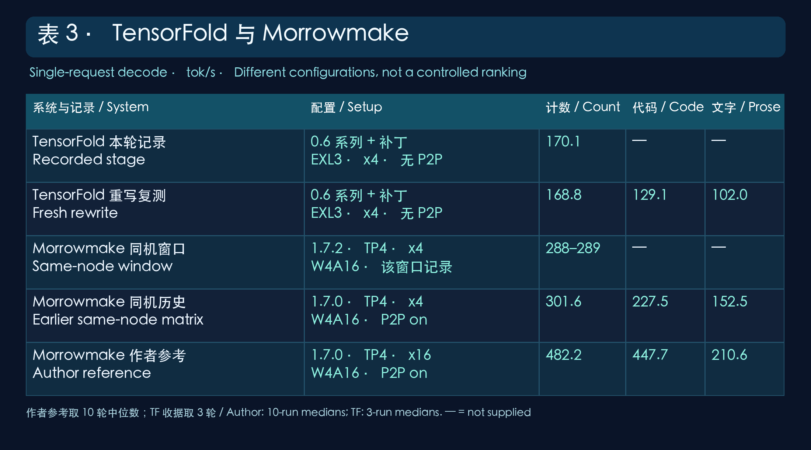

# 当 4 张 170 HX 遇上 TensorFold：首次打通实录

> 本文记录四张 170 HX 首次跑通 TensorFold 的过程：为什么要试、TensorFold 有什么特点、我们如何部署和验证、哪些优化有效或无效，以及相关改动在上游的进展。

---

## 一、缘起：两个很朴素的动机

TensorFold 是一个面向本地模型推理的开源框架，覆盖 CUDA 显卡和 Apple Silicon 等运行环境。它尝试把量化模型、GPU 计算内核和解码流程结合起来，让用户能在不同设备上部署模型。

看到社区里有人用 TensorFold 跑本地模型，自然会想到两个问题：

1. **别的设备能跑，四张 170 HX 能不能也跑起来？** 如果不行，究竟是硬件能力不够，还是框架的架构检查和执行路径还没有覆盖到？
2. **跑起来之后，性能还能不能改善？** 多卡推理除了单张卡的计算，还要看模型如何拆分、卡间数据怎样交换，以及解码策略是否适合当前任务。

于是有了这次尝试。我们先让服务稳定启动，再用固定提示建立测试基线；确认输出与对应串行结果一致后，围绕多卡通信逐项做 A/B 测试。计数任务的单条流生成从首次跑通时的 **61.6 tok/s**，提升到记录中的 **170.1 tok/s**。不同提示的结果和比较边界会在后文单独说明。

## 二、TensorFold 的特点：我们据此安排实验

理解框架的特点，才能知道适配和优化应该从哪里下手。这次重点关注四件事：

- **量化模型与显存占用：** 本次使用 EXL3 4-bit 权重，在有限显存里部署 GLM-5.3-Flash；量化格式本身不等于与未量化模型逐位相同。
- **投机解码与结果校验：** 框架会先提出候选 token，再由目标模型验证。我们把加速生成与同模型、同配置下的串行生成对照，校验本次测试回复是否一致。
- **多种 GPU 执行路径：** CUDA 内核和多卡分工都要匹配实际硬件。遇到架构检查时，不能只删掉检查，而要逐项确认所需内核能否运行。
- **多卡通信与真实瓶颈：** 四张卡需要交换中间结果。我们先测基线，再分别尝试共享内存中转和 BF16 通信载荷，并把没有带来稳定收益的方案也记录下来。

实验按这个顺序推进：先处理 Ampere 架构准入和 GLM 四卡启动，再固定提示与测量方式建立基线，最后一次只改一类通信因素，通过正确性检查和多轮数据判断是否保留。本文使用 TensorFold Python 0.6 维护线的适配记录；1.0.0 已采用 Zig 新引擎，不能把本文成绩当作新引擎跑分。

## 这次到底测了什么？先把条件摆出来

**全文的约 170 tok/s 主成绩，是单条流的 structured 提示测试：让模型顺序计数，生成规则性很强的文本。** 它不是读取结构化数据集，也不是 JSON 提取、表格分析或数据库查询的成绩。这样的输出容易被草稿预测，不能代表开放式写作的统一速度。

历史收据里的提示标签分别是 structured-count-1-200（从 1 到 200 顺序计数）、coding-clamp-range（生成 clamp_range 函数）和 hashmap-prose（解释哈希表）。它们是固定短提示的生成基准，不是结构化数据集分析、完整编程考试或长文质量评测。以下条件依据实验记录与上游 PR 收据整理，本文没有重新跑分。

表 1：测试条件与测量边界。

流式请求是一边生成一边返回；单条流表示一次请求。400 tokens 是请求输出预算，实际完成数应以响应记录为准。请求关闭思考不等于所有实现都一定没有推理文字，因此速率不能自动叫作“纯正文速度”。

这里报告记录中的生成速率，不把它改称从点击发送到整篇显示完成的端到端速度；首 token 等待和长输入处理要另行测量。三轮中位数适合记录趋势，但样本仍小，不能把微小波动都解释成稳定提升。

## 第一道关：不支持，究竟是哪一部分不支持？

框架原先要求较新的 NVIDIA 架构，而 170 HX 属于更早的 Ampere 一代。直接启动时，版本检查会拒绝继续。

但“版本检查不让进”和“每一种计算都做不了”是两回事。我们把实际需要的内核——也就是显卡执行计算的小程序——逐个检查、编译和测试。对能够在 Ampere 上工作的路径开放准入；依赖新架构特性的路径继续保留限制。

这相当于检查一套工具箱：旧工作台能用哪些工具，就先验证哪些；确实需要新设备的工具，也不硬说能用。不是简单删掉报错就算适配完成。

原稿的“300 亿级模型”表述不准确：这里运行的 GLM-5.3-Flash 是约 320B 总参数的 MoE。四卡适配不仅要让计算能执行，还要把权重和元数据按四个 rank 分配；rank 在这里可以理解成一张 GPU 对应的计算进程。

原记录报告了 293 项以上的相关内核测试通过，以及四卡服务端到端运行成功。这个数字描述的是已运行的相关测试，不等于所有版本、所有模型和所有功能都通过了完整认证。

## 第二道关：四张卡会算，还得能配合

四张卡分工计算时，需要互相交换中间结果。数据能多快到达下一张卡，会影响下一步何时开始。

可以把它想成四个人合写一份报告：每个人都有工作要做，但如果每一轮都要等别人把材料送来，最终速度就不只取决于谁写得快。

这次配置的 PCIe 链路比较窄，卡与卡之间也没有使用直接传递路径。于是我们把重点放在两个问题上：**怎样更高效地中转数据，以及能不能少传一些数据。**

下面这张图说明思路，硬件与连接均为示意。

一项改动使用主机共享内存作为中转区，让多个计算进程按约定交换数据。对应 A/B 测试记录了约 **21.5%** 的计数生成收益。

另一项改动减少部分通信载荷，把相关传输由 32 位改为 16 位表示。对应实验记录了约 **35.8%** 的收益，并在已测请求中保持与串行对照相同的生成结果。

这两个百分比来自各自的对照，不能直接相加，也不能当成所有任务都会获得的收益。减少载荷也不天然保证任何输入都完全等价，必须配合具体模型、计算路径和输出验证。

## 补回两项关键技术：数据怎么传，顺序怎么保留

共享内存方案的关键动作叫 all-gather：每张卡先放出自己的那份数据，再把其他卡的份额收齐。初稿对特定大小、类型的载荷走这条路径，超过 1 MiB 或不支持的类型仍回到 NCCL 通信库。因此，不能把小载荷的提速直接推到所有长输入处理上。

下游计算保持固定的 rank 顺序，是精确性验证的一部分。它避免仅为了通信变快，就随意改变加法顺序；浮点计算里，顺序不同可能带来细微数值差异。

32 位到 16 位的改动具体是 BF16 通信载荷表示。这是减少相关中间结果的传输字节，不是把整套模型再量化一遍。是否能保持所需结果一致，需要逐项数据检查和生成对照，不能只凭“字节减半”保证。

表 2：各阶段分别记录计数、代码和说明文字，避免只看计数最高值。

前两行来自通信 PR 的原始 A/B，第三行来自重新实现后的完整栈复测。第三行叠加了后续改动，不是只改一项变量的实验。原稿 61.6 tok/s 则是更早的首次适配阶段，也不应与 46.7 tok/s 的关闭草稿串行基线混为一谈。

## “输出一致”，说的是什么？

TensorFold 的一个重要目标，是加速生成时仍遵守它的精确性约定。

这里可以把投机生成理解成：先尝试提出后面几个 token，再按框架的验证流程确认，尽量减少一次只走一步的等待。token 是模型处理和生成文本的单位，不固定等于一个汉字或一个英文词。

本次记录使用相同的量化模型和测试条件，对比加速生成与关闭草稿的串行生成，已测回复的 SHA256 校验一致。也就是说，在这些测试里，没有因为开启加速而改变最终回复。

**这不表示 4-bit 量化模型与未量化原模型完全相同，也不表示任何提示、任何后端都一定生成同样答案。** 输出一致和答案质量也是不同问题：两次生成相同的内容，不代表内容一定正确。

## 速度走到了哪里？

计数任务的记录从首次适配的 61.6 tok/s，经过通信优化达到 169.7 tok/s，再经过小幅调整得到 170.1 tok/s。后续通信代码重新实现后，复测为 168.8 tok/s；该次窗口中，代码和说明文字分别记录为 129.1、102.0 tok/s。

把这条进展放在一起，更容易看清本次工作的重点。

这里的 170.1 tok/s 是计数任务的单条流结果，不是八请求总吞吐，也不是所有写作、代码和长输入任务的统一速度。168.8 与此前约 169–170 的结果接近，但仍需要更多重复测量来描述波动范围。

同一硬件的另一套 Morrowmake 配方曾记录约 289 tok/s。它说明别的实现路线可以更快，却不能单凭一个数字断言 TensorFold 的差距全部来自链路：权重格式、内核、调度、提示和计时口径都需要一起核对。300 tok/s 是原稿提出的目标，不是本次已经达到的成绩。

## 与 Morrowmake 放在一起：同机参考和作者参考分开看

你看到的 Morrowmake 数据有两种来源：我在相同硬件上的部署，以及作者更宽链路参考机上的测试。它们必须分开。

表 3：全部为单请求生成速率；破折号表示该条记录未提供，不用其他日期的数据拼补。

原稿窗口中，Morrowmake 同机验证约为 288–289 tok/s；TensorFold 170.1 大约是 289 的 59%。这个比例只描述所列计数成绩的距离，不能直接解读成同质量任务的效率差，也不能确定唯一原因。此前 Morrowmake 1.7.0 的 P2P-on 矩阵为 301.6／227.5／152.5；它是另一配置与测试记录，不能代替本窗口的 289。

作者 README 的 482.2／447.7／210.6 来自 1.7.0、Gen2 x16、P2P-on 参考机，单请求取十轮中位数。TensorFold 使用 Gen2 x4、EXL3 权重；Morrowmake 使用 W4A16 权重。即使模型家族、任务分类和 400-token 协议接近，链路、权重格式、计算实现、P2P、样本数和计时细节仍存在差异。

所以这张表的用途是交代“现在处于哪里”，不是宣布某个框架全面胜出。更严格的下一轮比较，应在同机、相同提示、实际输出长度和计时方式下，连同答案质量、首 token 等待一起测。

数据来源：[本机布局与升级记录](https://github.com/liumorrisclaw/cmp170hx-glm53-lab)、[Morrowmake 作者参考机与协议](https://github.com/Morrowmake/glm53-flash-cmp170hx-recipe)、[TensorFold 通信 PR 与复测](https://github.com/ashhart/TensorFold/pull/466)。

## 几个没有提速的想法，也值得留下来

把传输拆成几段，本来希望计算和传输交错进行，减少等待；实测差异约 0.1%，没有看到有意义的收益。

把相邻计算合并，想减少调用次数；有的方案基本持平，另一项小范围融合记录了约 0.2% 的变化。这样的小差异应谨慎看待，不能把一次正数直接当成稳定增益。

为什么“少调用几次”没有明显变快？因为框架已经把一些计算步骤打包成可重复执行的图，类似把一串操作先编排好，之后整体重放。原本想省掉的启动开销，可能已经很小。

更激进地增加草稿长度，也没有在已测对照中胜过默认策略。提前猜得更多，如果被接受得不够多，反而会多做无用功。

这些负结果帮助缩小下一步的搜索范围。但它们不能证明软件优化已经做完，或硬件的“物理极限”已经被完整测定。要进一步定位瓶颈，还需要更多任务、更长输入、更完整的时间分析和稳定性测试。

## 提交上游：跑通之后，还要把贡献说明白

本次向 TensorFold 上游提交了三个相关 PR。

作者在 [#464](https://github.com/ashhart/TensorFold/pull/464) 与 [#465](https://github.com/ashhart/TensorFold/pull/465) 中确认，Ampere 架构准入和 GLM 四卡支持已以我们的署名纳入主线历史。由于 Python 引擎冻结在 0.6.6，这些改动不会随新的 Python 标签版本发布。

通信方案 [#466](https://github.com/ashhart/TensorFold/pull/466) 则走了另一条路。作者认可实测收益，但指出初稿部分实现源自 Morrowmake 的代码；即使许可证兼容，项目也要求提交者独立编写实现。

于是，我们围绕 TensorFold 自身的通信需求重新实现并提交复测。四卡数据检查通过，已测生成回复仍与串行对照一致，性能维持在前述范围。**截至本次核对，这个 PR 仍处于开放状态，等待复审，不能写成已经合入。**

这也是开源协作很具体的一面：一个想法有用、代码能跑、来源和署名清楚、符合项目接收规则，都是要分别完成的事。

## 从“能不能跑”到“下一步测什么”

这次最明确的进展，是让旧版 TensorFold 在四张 170 HX 上跑通 GLM，并通过改善通信，把计数单条流速度从约 62 推进到约 170 tok/s。

接下来，比宣称“优化到头了”更有用的是继续测：真实代码和写作任务的质量与完成时间，长输入的等待，多请求下的吞吐，以及长期运行的稳定性。新引擎是否适合这套硬件，也需要独立适配与验证。

能跑起来，是起点。知道哪里有效、哪里没效，再把证据交回社区，才让下一次尝试有地方接着走。

## 致谢与资料

感谢 TensorFold 作者 ashhart 的实现、审阅和反馈；感谢 Morrowmake 的配方与通信实现带来的参考；感谢 Mia／MiaAI-Lab 的评测实践，智谱／Z.ai 的 GLM-5.3-Flash，以及 EXL3、量化权重和相关内核项目的贡献者。

原始故事与实验记录：[TENSORFOLD-FIRST-RUN-CN.md](https://github.com/liumorrisclaw/cmp170hx-glm53-lab/blob/main/TENSORFOLD-FIRST-RUN-CN.md)。上游版本说明：[ashhart/TensorFold](https://github.com/ashhart/TensorFold)。复现时请固定分支、提交、权重与测试配置，并核对各组件许可。

## English summary

Four CMP 170HX cards ran GLM-5.3-Flash through an adapted TensorFold Python 0.6-series stack with EXL3 4-bit weights and PCIe Gen2 x4 links. This is not a TensorFold 1.0.0 benchmark.

The headline is a single-request structured/counting prompt, not JSON extraction or structured-data analysis. The recorded protocol used streaming, temperature 0, a request to disable thinking, a 400-token output budget, warming, and three-run medians. Code and explanatory prose were separate fixed prompts. The rates do not include a verified full end-to-end client measurement.

Single-stream counting rose from 61.6 tok/s in the first working build to a recorded 170.1 tok/s after communication optimizations. A fresh rewrite later recorded 168.8 tok/s; code and prose recorded 129.1 and 102.0 tok/s in that retest. These are workload-specific observations, not universal generation rates or aggregate throughput.

Morrowmake recorded about 288–289 tok/s on the same hardware in the original window. Its separate 1.7.0 P2P-on matrix recorded 301.6 / 227.5 / 152.5 tok/s for counting / code / prose. The author's Gen2 x16 P2P-on reference recorded 482.2 / 447.7 / 210.6, using ten-run single-user medians. Different checkpoints, interconnects, configurations and timing details prevent a controlled framework ranking.

Measured accelerated replies matched serial replies for the same quantized model and test conditions. This does not establish equivalence to an unquantized model or guarantee identical results for every input.

The maintainer confirmed that #464 and #465 landed in main history under the contributor's name, but they will not ship in a new tagged Python release. The rewritten communication PR #466 remains open at this review. Hardware and communication images are illustrations. Results are limited to the tested workloads.
